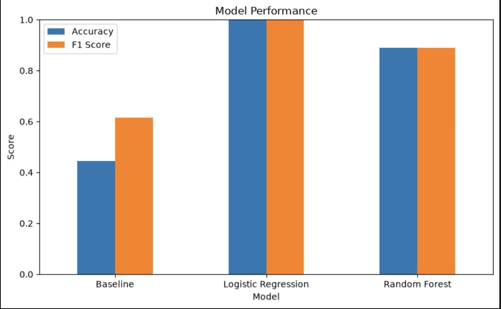
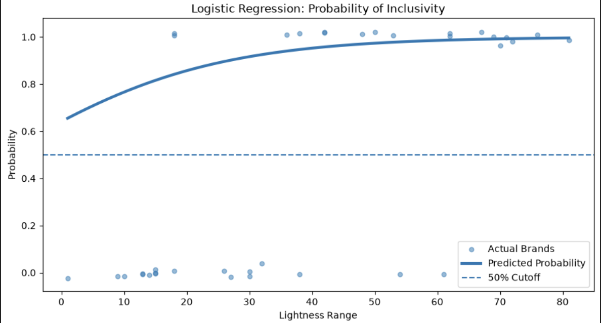
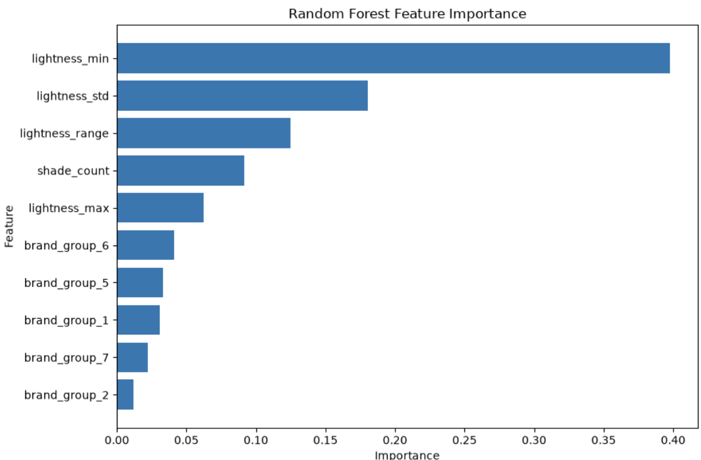

# My Data Science Projects 🌼

Here you'll find some of the projects I've created while exploring data, visualization, research, and machine learning.

<a class="button" href="index.html">← Home</a>

🌷 ✿ 🩵 ✿ 🌷

Project 01 🌼

# Poverty and Fertility Rates Across U.S. States

### 2007–2024 
## How has the relationship between poverty and fertility rates across U.S. states changed from 2007 to 2024?

# Key Findings
## Chart 1
This chart shows how the relationship between poverty and fertility rates across U.S. states changed from 2007 to 2024. A positive correlation means that states with higher poverty rates also tended to have higher fertility rates, while a correlation closer to zero means the relationship was weaker. The chart shows that this relationship was not consistent throughout the period and became weaker in some years. This instability may partly reflect the fact that poverty and fertility each followed their own separate trends over this time; for instance, poverty rates fluctuated with the economy (e.g., the 2008–2009 recession), while fertility rates were on a longer, steadier decline (USAFacts, 2026). Because these two variables were not always moving for the same reasons, their year-to-year correlation was unlikely to stay constant.

## Chart 2
This chart shows how the average fertility rate across U.S. states changed over time. The overall pattern can be compared with broader fertility trends in the United States. USAFacts (2026) reports that fertility rates declined in every state between 2004 and 2024. Similarly, the U.S. Census Bureau reports a long-term decline in the national fertility rate (Hayward et al., 2026). This helps provide context for the changes shown in my visualization and suggests that the state-level patterns in my data are part of a broader change in fertility across the United States.

## Sources 
My charts use data collected from the Census API. The Census and USAFacts articles are used to support and explain the trends shown in the charts.

Hayward, G. M., Rogers, L. T., & Sabo, S. (2026, June 25). South and Midwest had the highest fertility rates, but even the West and Northeast had pockets of high-fertility counties. U.S. Census Bureau. U.S. Census Bureau article

USAFacts. (2026, May 8). How have US fertility and birth rates changed over time? USAFacts article

U.S. Census Bureau. (2024). American Community Survey 1-year data. U.S. Department of Commerce.

### AI Assistance Disclosure

I used ChatGPT as a tool while working on this project. I used it to help troubleshoot errors in my Python code, understand how to retrieve and clean data from the U.S. Census API, and improve the organization of my visualizations. I reviewed the suggestions, tested the code myself, and edited the written responses to reflect my own understanding of the project and results.
<a class="button" href="https://github.com/nvue4-lgtm/poverty-fertility-analysis/blob/main/ResearchProject.ipynb" target="_blank">
View Project Code 💻
</a>

🌼 ✿ 🌷 ✿ 🌼

Project 02 🌷

# Makeup Shade Inclusivity Classification
## Project Overview
This project explores whether information about a makeup brand's foundation shade lineup can be used to predict whether the brand has a relatively inclusive range of deeper shades.

# Research Question
Can characteristics of a makeup brand's foundation shade lineup help predict whether the brand has an inclusive range of deeper shades?

# Background and Context
Foundation shade inclusivity has become a significant topic in the beauty industry. Some brands may offer a wide range of foundation shades but still provide limited options for individuals with deeper skin tones. Allure has pointed out that a large number of shades does not necessarily mean that the distribution is equitable across different skin tones. It has also highlighted brands that offer more comprehensive shade ranges (Abelman & Dall'Asen, 2020).

Access to these shades is another important issue. Sinks (2018) noted that while deeper foundation shades may be advertised by brands, they can still be difficult to find in physical drugstores. The launch of Fenty Beauty, which introduced 40 foundation shades, brought significant attention to shade inclusivity by emphasizing the creation of products for a wide variety of skin tones (Lang, 2017).

These concerns motivated me to analyze makeup shade data across various brands and utilize machine learning to explore patterns related to the representation of deeper shades.

# Dataset
The dataset comes from the Kaggle Makeup Shades Dataset.

Original dataset source:
https://www.kaggle.com/datasets/shivamb/makeup-shades-dataset?resource=download

# Target and Features
The dataset lacked an official inclusivity label, so I created a proxy for this project. I defined a "deeper shade" as one with a lightness (L) value in the darkest one-third of the dataset and calculated the proportion of deeper shades for each brand. A brand is considered inclusive if its share of deeper shades exceeds the median for all brands. This definition is specific to this project and should not be seen as a universal standard for inclusivity.

The model uses these features:
- Brand group
- Shade count
- Minimum lightness
- Maximum lightness
- Lightness range
- Lightness standard deviation

# Models
I compared three approaches:
1. Baseline model - always predicts the most common class.
2. Logistic Regression - used because the target has two classes and the model is easy to interpret.
3. Random Forest - used because it can learn more complex relationships between the features

# Model Results
Accuracy: 
Baseline - 0.444
Logistic Regression - 1.000
Random Forest - 0.889

F1 Score:
Baseline - 0.615
Logistic Regression - 1.000
Random Forest - 0.889

In a 5-fold cross-validation analysis, Logistic Regression achieved an average F1 score of approximately 0.971, while Random Forest had an average F1 score of around 0.921. Both machine learning models outperformed the baseline, with Logistic Regression yielding the strongest results in this comparison.

# Visualizations

This graph compares the baseline with logistic regression and random forest. Both models outperformed the baseline, with logistic regression achieving the highest test scores.

This graph illustrates how the predicted probability of being classified as Inclusive varies with changes in lightness range, assuming the other model features are held constant.

This graph illustrates the importance of various features in the Random Forest model. A longer bar indicates that the feature has a greater impact on the model's predictions. However, feature importance does not imply that the feature causes inclusivity.

# Main Findings
The analysis found a strong connection between a brand's shade-lightness characteristics and inclusivity targets. Logistic Regression performed best, achieving the highest cross-validation F1 score, indicating that shade lightness distribution effectively differentiates between classes in the dataset. However, results should be interpreted cautiously, as the target and predictors are based on shade lightness.

Foundation inclusivity involves more than just the number of shades offered; the distribution of those shades across the lightness spectrum is crucial. Brands with a wider lightness range and more variation in their shades were more likely to be considered inclusive of deeper skin tones.

Both machine-learning models identified patterns in the data, with Logistic Regression excelling. Factors like lightness range and variation among shades provide valuable insights into foundation shade diversity. However, the inclusivity label used in this project is based solely on shade data and does not fully reflect real-world inclusivity, as aspects like undertones, product availability, and customer experiences are also important.

Evaluating foundation inclusivity should consider both the variety of shades available and their distribution across different skin tones. Having a greater variety of shades does not necessarily indicate a more inclusive shade range.

# Limitations
This project has several limitations:
- The dataset includes only a limited number of brands.
- The inclusivity label is a project-specific proxy and not an official measure.
- Inclusivity encompasses more than lightness, such as undertones, product availability, geographic access, quality, and customer experience.
- The models may be influenced by how the lightness-based target was constructed.
- These models should not be used as a real-world rating system for makeup brands without more data and validation.

# References
Abelman, D., & Dall'Asen, N. (2020, June 28). 21 makeup brands that have the most inclusive foundation shade ranges. Allure. https://www.allure.com/gallery/makeup-brands-wide-foundation-shade-ranges
Bansal, S. (n.d.). Makeup shades dataset [Data set]. Kaggle. https://www.kaggle.com/datasets/shivamb/makeup-shades-dataset
Lang, C. (2017, November 16). Rihanna on building a beauty empire: "I'm going to push the boundaries in this industry." TIME. https://time.com/5026366/rihanna-fenty-beauty-best-inventions-2017/
Sinks, T. (2018, November 10). What are drugstores doing to factor inclusivity into their makeup aisles? Allure. https://www.allure.com/story/drugstore-foundation-range-inclusivity-in-the-makeup-aisle

# AI Usage Disclosure 
I used ChatGPT by OpenAI to help with debugging, code organization, and writing support. I reviewed and edited the final code and explanations to make sure they matched the goals of this project.

<a class="button" href="https://github.com/nvue4-lgtm/makeup_inclusivity/blob/main/makeup_inclusivity.ipynb" target="_blank">
View Project Code 💻
</a>

✿ 🩵 🌼 🩵 ✿

### More projects coming soon 🌱

I'm continuing to grow my data science skills one project at a time.

